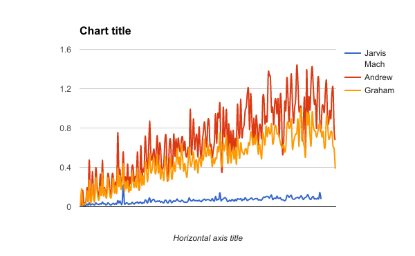
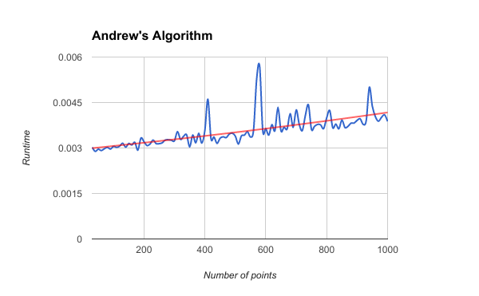
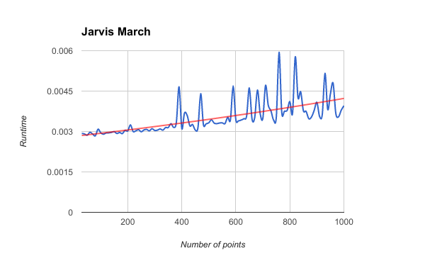
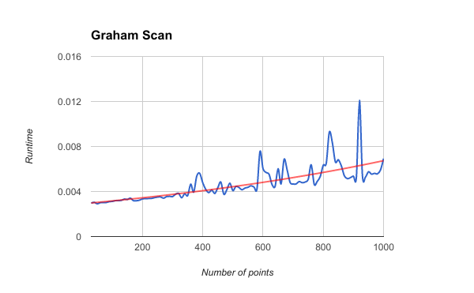
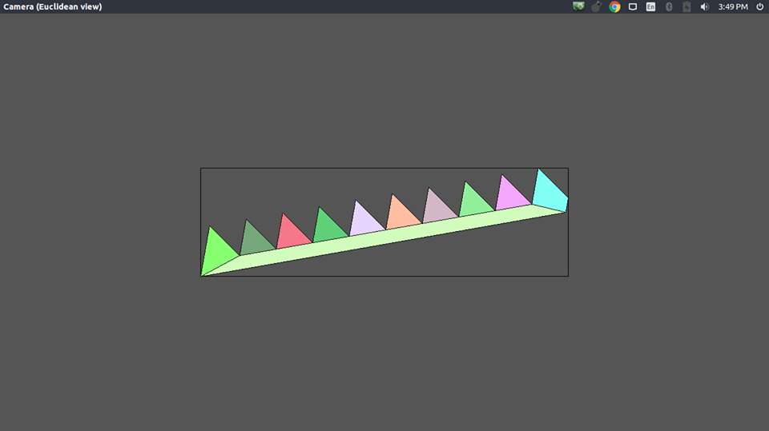
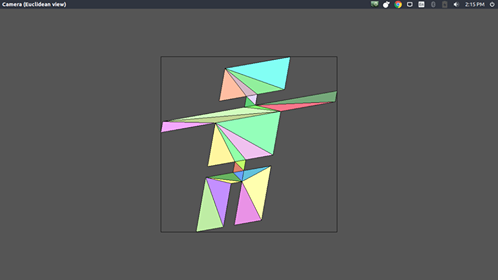

IMPLEMENTING COMPUTATIONAL GEOMETRY ALGORITHMS           {#mainpage}
====================================

Documentation for the Algorithms used
------------------------

> **Objective**: In this assignment, you have to implement three different convex hull algorithms as discussed in
> class. The code should be written such that it provides an API for others to interact with your code.
> Design your code properly. It will be good if you write your code in C++. If you want to use any other
> programming language then discuss with I/C. The code should be well documented, commented, and
> indented.

1. [Graham Scans Algorithm](https://en.wikipedia.org/wiki/Graham_scan)
   > Graham's scan is a method of finding the convex hull of a finite set of points in the plane 
   > with time complexity O(n log n). It is named after Ronald Graham, who published the original algorithm in 1972. 
   > The algorithm finds all vertices of the convex hull ordered along its boundary. 
   > It uses a stack to detect and remove concavities in the boundary efficiently.

2. [Andrews Algorithm](http://nms.csail.mit.edu/~aklmiu/6.838/convexhull/)  
   > Andrew's Algorithm is implemented by first sorting the points lexicographically (first by x-coordinate, and in case of a tie, 
   > by y-coordinate), and then constructing upper and lower hulls of the points in O(n) time.
   > An upper hull is the part of the convex hull, which is visible from the above. It runs from its rightmost 
   > point to the leftmost point in counterclockwise order. Lower hull is the remaining part of the convex hull.

3. [Jarvis Mach Algorithm](http://www.personal.kent.edu/~rmuhamma/Compgeometry/MyCG/ConvexHull/jarvisMarch.htm)
   > Jarvis march computes the CH(Q) by a technique known as gift wrapping or package wrapping.
   

****
ASSIGNMENT-2

****

4. [Doubly connected edge list] (https://en.wikipedia.org/wiki/Doubly_connected_edge_list)
   > The doubly connected edge list (DCEL), also known as half-edge data structure, is a data structure to represent an embedding of a planar graph in the plane, and polytopes in 3D. This data structure provides efficient manipulation of the topological information associated with the objects in question (vertices, edges, faces). It is used in many algorithms of computational geometry to handle polygonal subdivisions of the plane, commonly called planar straight-line graphs (PSLG).[1] For example, a Voronoi diagram is commonly represented by a DCEL inside a bounding box.
   
5. Partitioning a polygon into y-monotone polygons.

6. Triangulate each y-monotone polygon.

